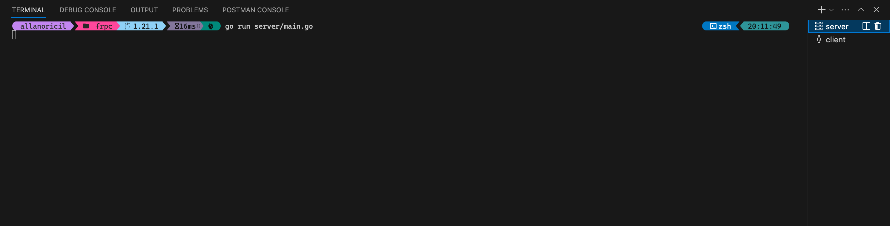
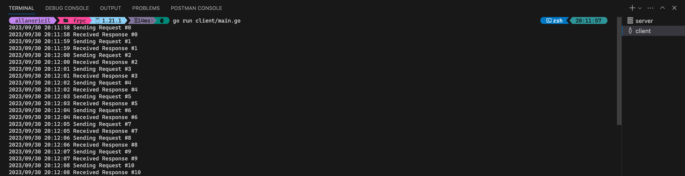

# Simplest fRPC Example

Contains the source code explained in the `Quick Start Guide` from https://frpc.io/getting-started/quick-start


## Requirements

go 		>= 1.18
protoc 	>= 3

```bash
brew install go
brew install protoc
```

## Go setup (optional if you have already done it)

Create a directory to serve as the workspace for your go projects

```bash
mkdir $HOME/go
```

Setup `GOPATH`, `GOBIN` and `PATH` env variables as follows

```bash
export GOPATH=$HOME/go
export GOBIN=$GOPATH/bin
export PATH=$PATH:$GOBIN
```

## 1 - Install protoc-gen-go-frpc

Install `protoc-gen-go-frpc` plugin

```bash
$ go install github.com/loopholelabs/frpc-go/protoc-gen-go-frpc@latest
which protoc-gen-go-frpc
```

From the root of this project, run the following comand to generate the server and client code using the specs in `echo.proto`

```bash
protoc --go-frpc_out=. echo.proto
```

## 2 - Install project dependencies

```bash
go mod download
```

## 3 - Run Server

Open a new terminal and start the server running the following command

```bash
go run server/main.go
```




## 4 - Run the Client

Open a new terminal and start the client running the following command

```bash
go run client/main.go
```



